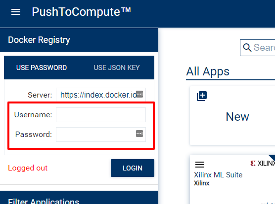
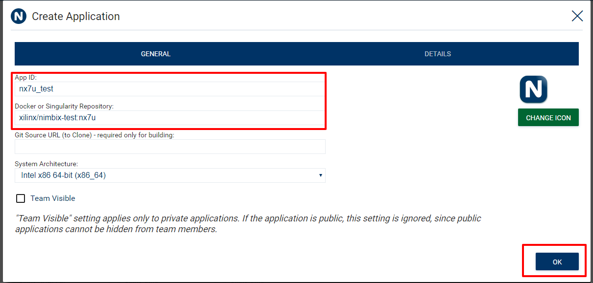

# Nimbix Container Flow for Library and Application

This project provides script to build Docker Application (image) for Nimbix Jarvice platform. 

## Usage

### Build Nimbix application flow

1. Clone nimbixlize repository

```
git clone https://gitenterprise.xilinx.com/FaaSApps/nimbixlize.git
```

2. Go to nimbixlize repository

```
cd nimbixlize
```

3. Update `config.json` file to specify all information for your application. See [here](doc/config.md) for all references.  

4. Build Nimbix image

```
./nimbixlize.py
```

5. Push built docker image (optional)

Push docker image if attribute `push_after_build` is `false` in `post_processors` section in config.json. 

```
docker push $(IMAGE ID)
```
### Nimbix PushToCompute™ flow

1. Login to [Jarvice platform](https://platform.jarvice.com/). 

If you need Nimbix account, please contact Tianyu Li (tianyul@xilinx.com) or Chuck Song (songc@xilinx.com).

2. Click tab PushToCompute™ on right menu. 


3. Login to docker registry with your docker hub credentials (on top left menu). 



4. Click "New" to create a new application

5. Fill `App ID` and `Docker or Singularity Repository`. Then click `OK`. 



6. Click menu icon on your new created app and click `Pull` then click `OK` to pull the image. 


7. If steps go well, you should see Container Pull Response pop window with `{ "status": "Pull successfully scheduled" }`. You can also check pulling status by clicking `History` under app menu. 

8. After pulling completed, click your new application to launch the job. 


## Reference

Please check these links for more details. 

* [PushToCompute™ Work Flow Deployment Guide](https://jarvice.readthedocs.io/en/latest/cicd/)
* [Nimbix Application Definition Guide (AppDef)](https://jarvice.readthedocs.io/en/latest/appdef/)
* [Dockerfile reference](https://docs.docker.com/engine/reference/builder/)
* [Docker build reference](https://docs.docker.com/engine/reference/commandline/build/)