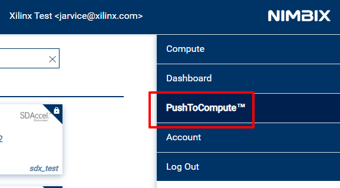
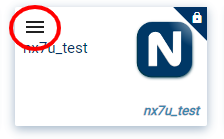
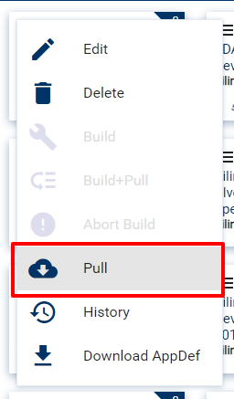

# Containerization Flow for Library and Application on Cloud Vendors

This project provides script to build Docker Application (image) for multiple cloud vendor: Nimbix, AWS and Azure. For now, it only supports Nimbix JARVICE™ platform and on premise.

## Background

### Docker

Docker is a set of platform-as-a-service (PaaS) products that use OS-level virtualization. Containers allow a developer to package up an application with all of the parts it needs, such as libraries and other dependencies, and ship it all out as one package. For more docker information, please refer to the [Docker Documentation](https://docs.docker.com). 

### Nimbix Cloud 

#### JARVICE™

JARVICE is the platform that powers the Nimbix Cloud. Built from the ground up for today’s most demanding workflows, it delivers superior performance, capabilities, and ease of use – whether enabling simulation, cognitive, life sciences, or other applications. For more information, please refer to the [The Nimbix Cloud Platform](https://www.nimbix.net/platform).

#### PushToCompute™

PushToCompute™ is an advanced developer pipeline that enables you to create, build, and deploy containerized workflows. The JARVICE container runtime is optimized for high performance and accelerated applications, and powers all workflows available in the Nimbix Cloud. For more information, please refer to the [PushToCompute™](https://www.nimbix.net/pushtocompute).

## Getting Started

To distribute FPGA applications on cloud vendors, you need build docker images contain FPGA app files (like xclbin files) and required metadata. The tutorial mainly contains two parts: prerequisites and buuild application flow. 

### Prerequisites

Before to build docker image and distribute it to could vendor, you need:

* Have an account on Docker Hub or your own docker registry. ([Create a Docker ID](https://hub.docker.com/signup))
* Create a repository on Docker Hub or your own docker registry.
* Install and active docker service on your local machine. ([Docker install](https://docs.docker.com/install/))
* To distribute app on Nimbix Jarvice platform, you need to have an account on Nimbix Jarvice platform. (If you need Nimbix account, please contact Tianyu Li (tianyul@xilinx.com) or Chuck Song (songc@xilinx.com).)

### Build  application flow

1. Clone Containerization  repository

```
git clone https://github.com/Xilinx/Containerization.git
```

2. Go to Containerization repository

```
cd Containerization 
```

3. Update `config.json` file to specify all information for your application. See [here](doc/config.md) for all references.  

4. Build image

```
./containerize.py
```

5. Push built docker image 

Only need to push docker image if attribute `push_after_build` is `false` in `post_processors` section in config.json. Otherwise the image will be pushed automatically. 

```
docker push $(IMAGE ID)
```

## Reference

### Nimbix PushToCompute™ flow

1. Login to [Jarvice platform](https://platform.jarvice.com/). 

If you need Nimbix account, please contact Tianyu Li (tianyul@xilinx.com) or Chuck Song (songc@xilinx.com).

2. Click tab PushToCompute™ on right menu. 



3. Login to docker registry with your docker hub credentials (on top left menu). 


4. Click "New" to create a new application

5. Fill `App ID` and `Docker or Singularity Repository`. Then click `OK`. 


6. Click menu icon on your new created app and click `Pull` then click `OK` to pull the image. 





7. If steps go well, you should see Container Pull Response pop window with `{ "status": "Pull successfully scheduled" }`. You can also check pulling status by clicking `History` under app menu. 

8. After pulling completed, click your new application to launch the job. 


9. You can change the application icon by clicking menu icon, then "Edit", then "Change Icon". 

### Useful links

Please check these links for more details. 

* [PushToCompute™ Work Flow Deployment Guide](https://jarvice.readthedocs.io/en/latest/cicd/)
* [Nimbix Application Definition Guide (AppDef)](https://jarvice.readthedocs.io/en/latest/appdef/)
* [Dockerfile reference](https://docs.docker.com/engine/reference/builder/)
* [Docker build reference](https://docs.docker.com/engine/reference/commandline/build/)
